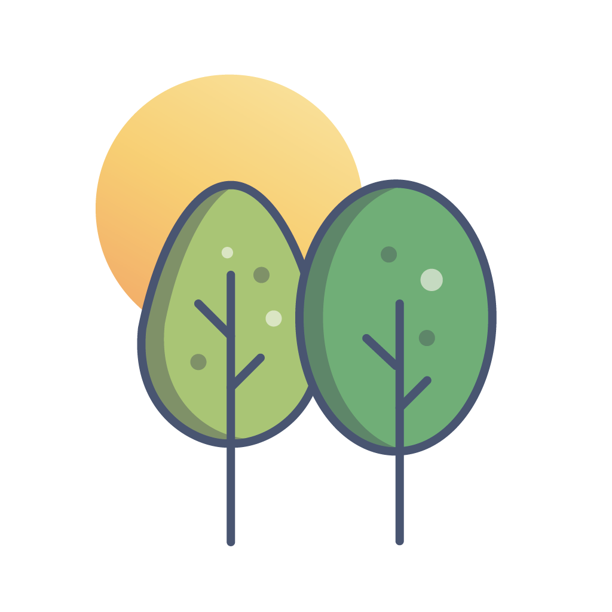

# Oasis

Oasis 找到你的心靈綠洲 
在繁忙的生活中為自己安排探秘小旅行，透過探索戶外自然景點，放鬆身心，感受大自然的美好 
在這裡你可以寫日記抒發心情，隨意的文字，純粹的紀錄生活，拋開社群互動壓力，留下旅行中的回憶點滴
  

## Features

### 探索地圖
##### 不知道該去哪裡？在地圖上找尋靈感，可即時顯示該地點天氣狀況，決定旅程目的地
* 地圖查看台灣北部地區的「營地」、「海攤」、「步道」、「公園」，四大類型戶外自然景點
* 即時顯示該地點天氣狀況
* 點擊愛心收藏喜愛的地點
  

### 新增日記
##### 透過地點打卡寫日記，只需選擇地標，不需輸入文字也可以無腦快速新增日記
* 可搜尋地標名稱
* 可調整日期，寫下過去的探秘日記
* 可添加照片
* 可重複編輯日記內容
  

### 個人檔案
##### 紀錄每次探索類型，時間軸呈現探秘日記，利用收藏的喜愛地點快速新增日記
* 可編輯個人檔案，加入照片及日記描述
* 數據統計及甜甜圈圖表，了解最常去的秘境類型
* 查看、編輯日記內容
* 透過收藏地點快速新增日記
